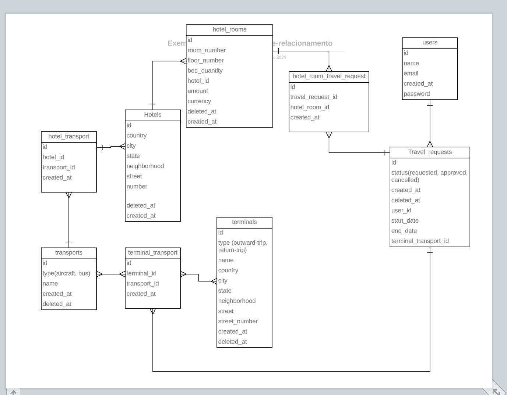

# Iniciando o projeto

> [!IMPORTANT]
> 
> Por que não foi usado Rector ou ECS nesse projeto?
> 
> Resolvi não utilizar para demonstrar como meu código é feito sem nenhuma das bibliotecas citadas.
> Ou seja, é apenas como escrevo meu código naturalmente.

Rode os seguintes comandos em sequência:

1. `cp .env.example .env`
2. `docker compose build`
3. `docker compose run app php artisan composer install`
4. `docker compose run app php artisan migrate`
5. `docker compose run app php artisan key:generate`
6. `docker compose run app php artisan jwt:secret`
7. `docker compose run app php artisan db:seed`

## Como fazer login?

Segue os dois usuários criados no sistema:

Usuário #1

- email: a@yuriasthar.com
- password: password

Usuário #2

- email: b@yuriasthar.com
- senha: password

### Quais APIs o projeto possui?

Endpoint base de qualquer request na API:

- http://api.localhost:8000

#### (API) Login

- endpoint: `http://api.localhost:8000/auth/login`
- method: `POST`
- body: `{"email": "a@yuriasthar.com", "password": "password"}`
- headers: `{"accept": "application/json"}`
- authorization: `no authorization`

#### (API) Logout

- endpoint: `http://api.localhost:8000/auth/logout`
- method: `POST`
- body: `no body`
- headers: `{"accept": "application/json"}`
- authorization: `{"authorization": "bearer $token"}`

#### (API) Me

- endpoint: `http://api.localhost:8000/auth/me`
- method: `GET`
- body: `no body`
- headers: `{"accept": "application/json"}`
- authorization: `{"authorization": "bearer $token"}`

#### (API) Refresh

- endpoint: `http://api.localhost:8000/auth/refresh`
- method: `POST`
- body: `no body`
- headers: `{"accept": "application/json"}`
- authorization: `{"authorization": "bearer $token"}`

#### (API) Criar um pedido de viagem

- endpoint: `http://api.localhost:8000/travel-requests`
- method: `POST`
- body: `{"terminal_transport_id": 1, "hotel_room_ids": [1, 2, 3], "start_date": 1732581663, "end_date": 1734223263}`
- headers: `{"accept": "application/json"}`
- authorization: `{"authorization": "bearer $token"}`

O que significa cada campo?

- `start_date`: é o período inicial da viagem;
- `end_date`: é o período final da viagem;
- `terminal_transport_id`: é o `ID` da tabela pivot entre um `transport` e um `terminal`;
- `hotel_room_ids`: é o `ID` da tabela `hotel_rooms`, como o nome sugere, é os `quartos que você escolheu para sua viagem`.

> [!NOTE] 
> 
> O que é `transport`?
>
> `Transport` é o veículo da viagem que pode ser `aircraft`(avião) ou `bus`(onibus).


> [!NOTE] 
> 
> O que é `terminal`?
>
> `Terminal` é o lugar que você terá que ir para pegar seu `transport`, existem dois tipos de `terminal`:
> 
> - `outward-trip`: Viagem de ida, quando você estiver indo para a viagem, você vai para este terminal pegar o seu `transport`;
> - `return-trip`: Viagem de volta, quando voc6e estiver voltando de viagem, você vai para este terminal pegar o seu `transport`.

> [!NOTE]
>
> Como saber os IDs para o campo `teminal_transport_id`? Utilize o endpoint de [(API) Listar Terminal e Transport](#api-listar-terminal-e-transport)

> [!NOTE]
>
> Como saber os IDs para o campo `hotel_room_ids`? Utilize o endpoint de [(API) Listar Hotel e suas Rooms](#api-listar-hotel-e-suas-rooms)

#### (API) Listar Terminal e Transport

> [!IMPORTANT]
>
> essa API não tem nenhum filtro, pois é somente para visualizar os IDs para fazer a request principal que é [(API) Criar um pedido de viagem](#api-criar-um-pedido-de-viagem)!

- endpoint: `http://api.localhost:8000/internal/terminal-transport`
- method: `GET`
- body: `no body`
- headers: `{"accept": "application/json"}`
- authorization: `{"authorization": "bearer $token"}`

#### (API) Listar hotel e suas Rooms

> [!IMPORTANT]
>
> essa API não tem nenhum filtro, pois é somente para visualizar os IDs para fazer a request principal que é [(API) Criar um pedido de viagem](#api-criar-um-pedido-de-viagem)!

- endpoint: `http://api.localhost:8000/internal/hotels`
- method: `GET`
- body: `no body`
- headers: `{"accept": "application/json"}`
- authorization: `{"authorization": "bearer $token"}`

#### (API) Atualizar um pedido de viagem

- endpoint: `http://api.localhost:8000/travel-requests/1`
- method: `PUT`
- body: `{"status": "approved"}`
- headers: `{"accept": "application/json"}`
- authorization: `{"authorization": "bearer $token"}`

> [!CAUTION]
> 
> O campo `status` aceita somente os valores `approved` ou `cancelled` nessa API

#### (API) Listar pedidos de viagem

- endpoint: `http://api.localhost:8000/travel-requests`
- method: `GET`
- body: `no body`
- headers: `{"accept": "application/json"}`
- authorization: `{"authorization": "bearer $token"}`

Quais `filtros` disponíveis?

- `filter[status]`: Pode conter qualquer um dos seguintes valores `approved`, `cancelled` ou `requested`;
- `filter[hotel_name]`: Pode conter qualquer string;
- `filter[terminal_type]`: Pode conter qualquer um dos seguintes valores `outward-trip` ou `return-trip`;
- `filter[transport_type]`: Pode conter qualquer um dos seguintes valores `aircraft` ou `bus`;
- `filter[start_date_greater_than]`: É necessário passar um timestamp; 
- `filter[start_date_less_than]`: É necessário passar um timestamp;
- `filter[end_date_greater_than]`: É necessário passar um timestamp;
- `filter[end_date_less_than]`: É necessário passar um timestamp;
- `filter[created_at_greater_than]`: É necessário passar um timestamp;
- `filter[created_at_less_than]`: É necessário passar um timestamp.

Quais `include` disponíveis?

- `include`: `user`;
- `include`: `terminalTransport`;
- `include`: `terminalTransport.terminal`;
- `include`: `terminalTransport.transport`;
- `include`: `hotelRooms`;
- `include`: `hotelRooms.hotel`;

Quais `sort` disponíveis?

- `sort`: `id` (Ordem crescente)
- `sort`: `-id` (Ordem decrescente)

#### (API) Mostrar pedidos de viagem

- endpoint: `http://api.localhost:8000/travel-requests/1`
- method: `GET`
- body: `no body`
- headers: `{"accept": "application/json"}`
- authorization: `{"authorization": "bearer $token"}`

# Como checar os emails?

Abra o seguinte link no seu navegador de preferências:

- [link para ver os emails enviados](http://localhost:1080/)

Segue o link bruto caso não abra acima:

- http://localhost:1080/

## Quando a notificação de solicitação enviada foi aprovada ou cancelada acontece?

Resolvi fazer um `listener` que escuta o evento de `updated` do model `TravelRequest`, então o toda vez
que o status muda para `approved` ou `cancelled`, a notificação é enviada.

Segue os passos abaixo para enviar a notificação:

- Faça uma request na [(API) Atualizar um pedido de viagem](#api-atualizar-um-pedido-de-viagem);
- No corpo dessa request muda o campo `status` para `approved`

Exemplo:

```
{
  "status": "approved"
}
```

> [!WARNING]
> 
> Siga as regras da API de Atualizar um pedido de viagem, caso o seu pedido já esteja `approved` ou `cancelled` um erro 422 será retornado

# Imagem do Diagrama Entidade Relacionamento do Banco de Dados


